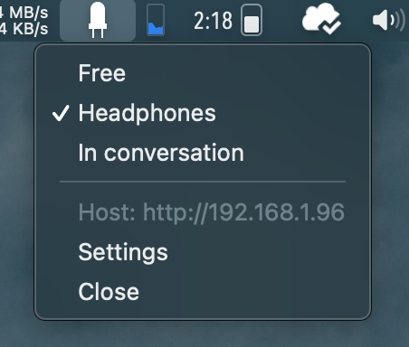

# WLED Status Switch - MacOS Menu Bar App

This is a tiny menu bar app that helps me to set a [WLED](https://github.com/Aircoookie/WLED) controlled LED strip to different predefined states. That way i communicate to my flatmates if it's okay to disturb me.

The idea came during the increasing amount of homeoffice work i did during the Corona lockdown. People tended to start talking to me while i was in a call and i wanted to have a kind of "on air" sign like in a radio studio.
